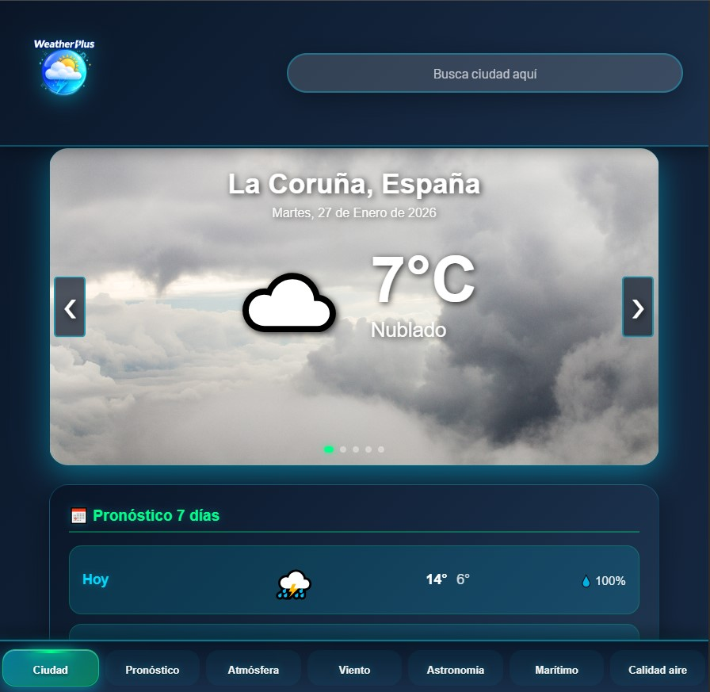

[PlusWeather 🌤️]

Aplicación meteorológica progresiva (PWA) con pronóstico completo, datos marítimos, calidad del aire y favoritos. Funciona 100% offline una vez instalada.

✨ Características
Característica	✅ Estado
Datos meteorológicos en tiempo real	Open-Meteo API
Pronóstico 7 días	☀️🌧️❄️
Condiciones atmosféricas completas	Humedad, presión, UV, visibilidad
Datos de viento detallados	Velocidad, ráfagas, dirección
Datos astronómicos	Amanecer, atardecer, horas de sol
Datos marítimos	Altura de olas, corrientes
Calidad del aire	PM2.5, PM10, NO₂, O₃
Sistema de favoritos (máx. 3 ciudades)	💾 Persistente
Navegación por swipe y flechas	📱👆
Fondos dinámicos según clima	🌤️🌧️⛄
PWA instalable	Icono personalizado
Offline-first	Service Worker
Responsive	Móvil + Desktop

🤖 Uso de Inteligencia Artificial
Para el desarrollo de este proyecto se contó con el apoyo de ChatGPT/Claude en las siguientes tareas:
Refactorización: Optimización de la lógica del Service Worker para el modo offline.
Depuración: Resolución de errores en la persistencia de datos con LocalStorage.
Documentación: Generación de la estructura base del pojecto y traducción de términos técnicos.

Captura de pantalla :

📱 Demo en vivo
🔗 https://webermuros1-oss.github.io/AppWeather/

Para instalar:

Abre en Chrome/Safari móvil

Menú → "Añadir a pantalla de inicio"

¡Listo! Funciona sin internet

🏗️ Estructura del proyecto

AppWeather/
├── index.html          # Página principal
├── json/
│   └── manifest.json   # Configuración PWA
├── css/
│   ├── index.css       # Estilos principales
│   ├── header.css      # Header
│   └── footer.css      # Footer
├── js/
│   ├── index.js        # Lógica principal + APIs
│   ├── header.js       # Web Component Header
│   ├── footer.js       # Web Component Footer
│   └── serviceWorker.js # Cache offline
└── media/images/
    ├── logoRemaster192.png  # Icono PWA 192px
    ├── logoRemaster512.png  # Icono PWA 512px
    ├── fondos climáticos... # Imágenes dinámicas

🚀 Instalación local
bash
# 1. Clona el repositorio
git clone https://github.com/webermuros1-oss/AppWeather.git
cd AppWeather

# 2. Servidor local (importante para PWA)
# Opción A: Live Server (VSCode)

# 3. Abre http://localhost:8000
🔧 APIs utilizadas

https://open-meteo.com/

🎨 Personalización
🏙️ Cambiar ciudad por defecto
Modifica la ciudad principal que aparece al iniciar la app:

js
// js/index.js  — línea ~140
const favoritesManager = new FavoritesManager(3, "Madrid"); // ← Cambia aquí
🗺️ Añadir más ciudades favoritas
Aumenta el número máximo de ciudades que pueden guardarse como favoritas:

js
// js/index.js  — línea ~90
constructor(maxFavorites = 5, defaultCity = "Valencia"); // ← Cambia el 3 por 5
🖼️ Iconos personalizados
Sustituye el icono por defecto de la aplicación por uno propio:

json
// json/manifest.json
"src": "/AppWeather/media/images/logoRemaster.png"
💡 Consejo: usa imágenes en formato PNG de 192x192 y 512x512 px para lograr compatibilidad total con el instalador PWA.

🛠️ Tecnologías
xml
HTML5 | CSS3 | Vanilla JavaScript | PWA | Service Workers | Web Components | LocalStorage | Fetch API | Open-Meteo

🔄 Service Worker (Offline)
Cachea: HTML, CSS, JS, iconos

Excluye: APIs meteorológicas (siempre frescas)

Estrategia: Cache-first (assets) + Network-first (APIs)

📱 Funcionalidades móviles

✅ Swipe izquierda/derecha → Cambiar ciudades

✅ Input predictivo → Buscar cualquier ciudad

✅ Persistencia → Favoritos guardados

✅ Modo oscuro → Automático

✅ Splash screen → Personalizado

⚠️ Posibles problemas y soluciones
Problema	Solución
Icono gris "G"	Verifica las rutas definidas en el archivo manifest.json.
No carga datos	Abre DevTools → Application → Service Workers y selecciona Unregister, luego recarga la página.
No funciona offline	Espera unos segundos tras la primera instalación para que el Service Worker complete su registro.
GitHub Pages lento	Espera de 2 a 5 minutos después del último push hasta que se refresque el servicio.
🤝 Cómo contribuir
¿Quieres apoyar el proyecto o mejorar alguna funcionalidad? ¡Aquí tienes cómo hacerlo! 🚀

Haz un Fork del repositorio:

bash
git clone https://github.com/webermuros1-oss/AppWeather.git
Crea una nueva rama para tu funcionalidad o mejora:

bash
git checkout -b feature/nueva-ciudad
Realiza tus cambios y haz un commit descriptivo:

bash
git commit -m "Añade nueva funcionalidad: ciudad adicional"
Sube tu rama al repositorio remoto:

bash
git push origin feature/nueva-ciudad
Abre un Pull Request desde GitHub para revisión y merge.

💡 Consejo: antes de enviar tu PR, revisa que el modo offline y las rutas del manifest funcionen correctamente.

📄 Licencia
Este proyecto está bajo la Licencia MIT - ver el archivo LICENSE para más detalles.

Made with ❤️ por webermuros1-oss
¡Instala PlusWeather en tu móvil hoy! 🌟

