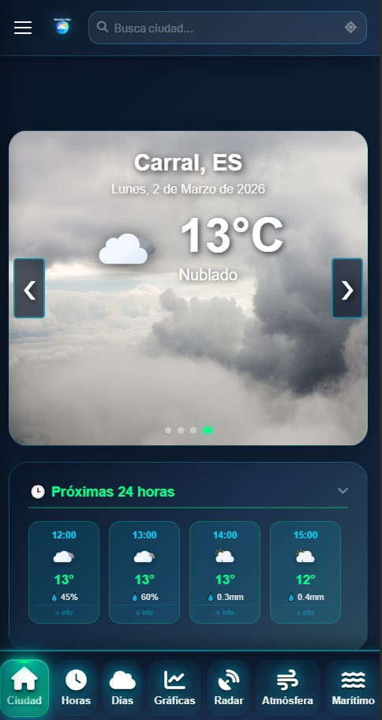

# 🌤️ PlusWeather — PWA Meteorológica Inteligente

> Aplicación meteorológica progresiva (PWA) con pronóstico completo, datos marítimos, calidad del aire, radar de precipitaciones, gráficas avanzadas y sistema de favoritos.
> Funciona **100% offline** una vez instalada y ofrece una experiencia rápida, moderna y personalizable.

---

## ✨ Características principales

| Característica | Descripción / Fuente |
|---|---|
| 🌦️ Datos meteorológicos en tiempo real | Open-Meteo API |
| 🕒 Pronóstico 24 horas | Con modal de detalle al tocar cada hora |
| 🗓️ Pronóstico 7 días | Con modal de detalle al tocar cada día |
| 🌡️ Condiciones atmosféricas | Humedad, presión, UV, visibilidad, CAPE |
| 🌬️ Datos de viento | Velocidad, ráfagas, dirección, escala Beaufort |
| 🌅 Datos astronómicos | Amanecer, atardecer, horas de sol |
| 🌊 Datos marítimos | Altura de olas, período, corrientes oceánicas |
| 🫧 Calidad del aire | AQI, PM2.5, PM10, NO₂, O₃, SO₂, CO |
| 📊 Gráficas detalladas | Viento, temperatura, lluvia, oleaje, AQI |
| 🛰️ Radar de precipitaciones | RainViewer global, tiempo real, auto-refresh |
| 🔍 Búsqueda con autocompletado | Sugerencias con bandera de país al escribir |
| 📍 GPS de precisión | Nombre de calle exacta via Nominatim/OSM |
| 🌙 Iconos día/noche | Meteocons SVG animados según hora local |
| 🖼️ Fondos dinámicos día/noche | Cambian según clima e iluminación real |
| ❤️ Sistema de favoritos | Persistente con LocalStorage, hasta 4 ciudades |
| 👆 Navegación intuitiva | Swipe + flechas + footer con scroll automático |
| 📲 Instalación PWA | Icono y splash personalizados |
| ⚡ Offline-first | Cache adaptable con Service Worker |
| 💻 Responsive | Compatible en móvil y desktop |

---

## 🖼️ Captura de pantalla



---

## 📱 Demo en vivo

👉 [**https://webermuros1-oss.github.io/AppWeather/**](https://webermuros1-oss.github.io/AppWeather/)

### Instalar como PWA

1. Abre el enlace en **Chrome o Safari móvil**
2. Toca el menú → **"Añadir a pantalla de inicio"**
3. ¡Listo! La aplicación funcionará **sin conexión** 🌍

---

## 🗂️ Estructura del proyecto

```
AppWeather/
├── index.html                  # Página principal
├── json/
│   └── manifest.json           # Configuración PWA
├── css/
│   ├── index.css               # Estilos principales
│   ├── header.css              # Header + buscador + sidebar
│   ├── footer.css              # Footer de navegación
│   ├── charts.css              # Página de gráficas
│   └── radar.css               # Página de radar
├── js/
│   ├── index.js                # Lógica principal + APIs + modales
│   ├── header.js               # Componente Header (autocompletado + GPS)
│   ├── footer.js               # Componente Footer (navegación + scroll)
│   ├── charts.js               # Gráficas con Chart.js
│   └── serviceWorker.js        # Lógica offline
├── pages/
│   ├── charts.html             # Página de gráficas y analíticas
│   └── radar.html              # Página de radar de precipitaciones
└── media/images/
    ├── logoRemaster.png        # Logo app
    ├── logoRemaster192.png     # Icono PWA (192px)
    ├── logoRemaster512.png     # Icono PWA (512px)
    ├── sunny1.jpg              # Fondos dinámicos de día
    ├── night1.jpg              # Fondos dinámicos de noche
    └── ...                     # Resto de fondos por condición
```

---

## 🚀 Instalación local

```bash
# 1. Clona el repositorio
git clone https://github.com/webermuros1-oss/AppWeather.git
cd AppWeather

# 2. Ejecuta un servidor local (requerido para PWA y GPS)
# Opción recomendada: extensión "Live Server" en VSCode

# 3. Abre en el navegador
http://localhost:5500
```

> ⚠️ El GPS y el Service Worker **requieren servidor local o HTTPS**. No funcionarán abriendo el HTML directamente desde el explorador de archivos.

---

## 🔧 APIs utilizadas

| API | Uso | Coste |
|---|---|---|
| [Open-Meteo](https://open-meteo.com/) | Meteorología, pronóstico, viento, UV | Gratuita |
| [Open-Meteo Marine](https://marine-api.open-meteo.com/) | Olas, corrientes, oleaje | Gratuita |
| [Open-Meteo Air Quality](https://air-quality-api.open-meteo.com/) | AQI, PM2.5, PM10, gases | Gratuita |
| [Nominatim / OpenStreetMap](https://nominatim.org/) | Reverse geocoding de precisión (calle) | Gratuita |
| [BigDataCloud](https://www.bigdatacloud.com/) | Fallback de reverse geocoding | Gratuita |
| [RainViewer](https://www.rainviewer.com/api.html) | Radar de precipitaciones global | Gratuita |
| [Meteocons](https://bas.dev/work/meteocons) | Iconos SVG animados día/noche | Gratuita (CDN) |

---

## 🌙 Fondos dinámicos día/noche

La app detecta si es de día o de noche en la ubicación consultada y cambia el fondo automáticamente. Coloca las imágenes en `media/images/` con estos nombres:

| Condición | Día | Noche |
|---|---|---|
| Despejado | `sunny1.jpg`, `sunny2.jpg`, `beach.jpg` | `nightClear1.jpg` |
| Nublado | `cloudy1.jpg`, `cloudy2.jpg` | `nightCloudy1.jpg` |
| Lluvia | `rainy1.jpg`, `rainy2.jpg`, `rainy3.jpg` | `nightRainy1.jpg` |
| Nieve | `snowy1.jpg`, `snowy2.jpg` | `nightSnowy1.jpg` |
| Tormenta | `stormy1.jpg`, `stormy2.jpg` | `nightStormy1.jpg` |
| Niebla | `foggy1.jpg`, `foggy2.jpg` | `nightFoggy1.jpg` |
| Por defecto | `bg1.jpg` … `bg5.jpg` | `night1.jpg`, `night2.jpg`, `night3.jpg` |

---

## 📊 Páginas adicionales

### Gráficas (`pages/charts.html`)
- Índice de Calidad del Aire (AQI) con estándares europeos y americanos
- Gráfica de velocidad del viento 24h con brújula animada y escala Beaufort
- Probabilidad de lluvia 7 días
- Temperatura 24h
- Altura de olas vs oleaje marino

### Radar (`pages/radar.html`)
- Mapa interactivo con capa de precipitaciones de RainViewer
- Control de opacidad
- Auto-refresh cada 10 minutos
- Centrado automático en la ubicación del usuario

---

## 🤖 Inteligencia Artificial en el desarrollo

**PlusWeather** fue desarrollado con asistencia de **Claude (Anthropic)**, integrando IA como herramienta de apoyo humano en distintos puntos del proceso.

### 🔧 Rol de la IA

| Área | Contribución |
|---|---|
| Arquitectura del código | Propuesta de estructura modular con Web Components |
| APIs y datos | Integración de Open-Meteo, RainViewer, Nominatim y Meteocons |
| Modales interactivos | Diseño de bottom-sheet para detalle de horas y días |
| Iconos animados | Implementación de Meteocons con soporte día/noche |
| GPS de precisión | Reverse geocoding a nivel de calle con Nominatim |
| Autocompletado | Buscador con sugerencias en tiempo real y banderas |
| Gráficas | Visualizaciones con Chart.js para viento, lluvia y oleaje |
| Radar | Integración de RainViewer sobre mapa Leaflet |
| Fondos dinámicos | Sistema día/noche según `is_day` de la API |
| Navegación | Footer con scroll automático a secciones via anchor hash |
| Service Worker | Estrategia cache-first para assets, network-first para APIs |
| Documentación | Generación de README estructurado y actualizado |

En todos los casos, el código generado fue revisado, comprendido y adaptado manualmente antes de integrarse al proyecto.

---

## 🚀 Posibles futuras integraciones

- Predicción meteorológica híbrida combinando datos en tiempo real y análisis histórico
- Asistente por voz para consultas locales
- Notificaciones push según condiciones meteorológicas (lluvia inminente, UV alto)
- Alertas personalizadas por tipo de actividad (surf, senderismo, ciclismo)
- Widget para pantalla de inicio con actualización periódica

---

## ⚠️ Posibles problemas y soluciones

| 🧩 Problema | 💡 Solución |
|---|---|
| **Icono gris "G"** | Verifica las rutas en `manifest.json` |
| **No carga datos** | DevTools → Application → Service Workers → Unregister → Recargar |
| **No funciona offline** | Espera unos segundos tras la primera instalación para que el SW se registre |
| **GPS solo apunta al centro de la ciudad** | Asegúrate de dar permiso de ubicación precisa en el navegador |
| **Imágenes nocturnas no aparecen** | Comprueba que los nombres de archivo coincidan exactamente (camelCase, sin doble extensión) |
| **GitHub Pages lento** | Espera 2-5 minutos tras el último push |
| **Autocompletado no aparece** | Escribe al menos 2 caracteres; comprueba la conexión a internet |

---

## 🛠️ Tecnologías

```
HTML5 · CSS3 · Vanilla JavaScript · PWA · Service Workers
Web Components · LocalStorage · Fetch API
Open-Meteo · Nominatim · RainViewer · Chart.js · Leaflet · Meteocons
```

---

## 📄 Licencia

Este proyecto está bajo la **Licencia MIT** — ver el archivo [LICENSE](LICENSE) para más detalles.

---

<div align="center">

Made with ❤️ por **webermuros1-oss**

⭐ Si te gusta el proyecto, ¡dale una estrella en GitHub!

[🌐 Demo en vivo](https://webermuros1-oss.github.io/AppWeather/) · [🐛 Reportar un bug](https://github.com/webermuros1-oss/AppWeather/issues) · [💡 Sugerir mejora](https://github.com/webermuros1-oss/AppWeather/issues)

</div>
